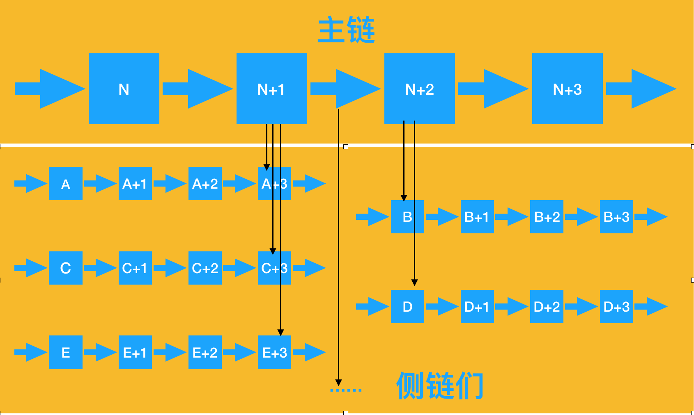

# 智能合约

* 智能合约
	* [1.开始之前](#1开始之前)
	* [2.应用节点同步](#2应用节点同步)
	* [3.初始化](#3初始化)
	* [4.helloworld](#4helloworld)
	* [5.发币转币](#5发币转币)
	* [6.数据储存](#6数据储存)
	* [7.单节点运行与多节点运行](#7单节点运行与多节点运行)

### 1.开始之前
开始编写合约之前，大家一定保证看完前一章[开发前准备](./before_dev.md)，保证大家的测试主链已经运行起来，开始出块。

我们再来回顾下entanmo主链与侧链的关系，请看下图：

	1.主链与侧链出块数相互独立，但是只有主链出块，侧链才会出块（比如：主链出块10000，侧链可以从0开始出块）。
	2.侧链之间相互独立，各不影响。
	3.各个侧链之间的价值交换，需要通过主链完成。
	4.可以起无数条侧链，这也是第一章讲的侧链之间是合作共赢关系，可以无限横向拓展。

### 2.应用节点同步
一般entanmo出块节点是需要投票和挖矿来决定的，所以在现实情况中，我们一般只是充当一个应用节点，只同步数据，而此应用节点会维护自己的一条侧链（在多节点情况下，充当一个侧链的出块节点。）

#### 配置
假设出块节点ip为：xxx.xx.xx.xxx，端口4096，如果是测试主链（第一章已经可以知道如何搭建测试主链），端口就是config.json中的端口，ip就是本机ip。
	
#### 同步数据

*ps：如果大家闲麻烦，测试主链节点也可以当作应用节点完全可以不用再同步，即可跳过此步骤*

实际情况是出块节点与应用节点不是同一台电脑（也不推荐在出块节点上跑应用，测试当然是可以的）所以我们需要以下步骤。

	//clone 最新的entanmo代码 xxx 代表稳定release分支
	git  clone -b xxx https://github.com/entanmo/etm.git
	//修改配置
	"peers": {
   		"list": [
      		{"ip": "xxx.xx.xx.xxx", "port": 4096}
    	],
    	...
    }
 
参考[config.json](../img/config_sigle_node.json)

配置完成以后即可启动应用节点
	
	//可以参考第一章，启动主链，启动侧链也是一样的
	node app.js
TODO:缺少运行成功图片

### 3.初始化

### 4.helloworld

### 5.发币转币

### 6.数据储存

### 7.单节点运行与多节点运行